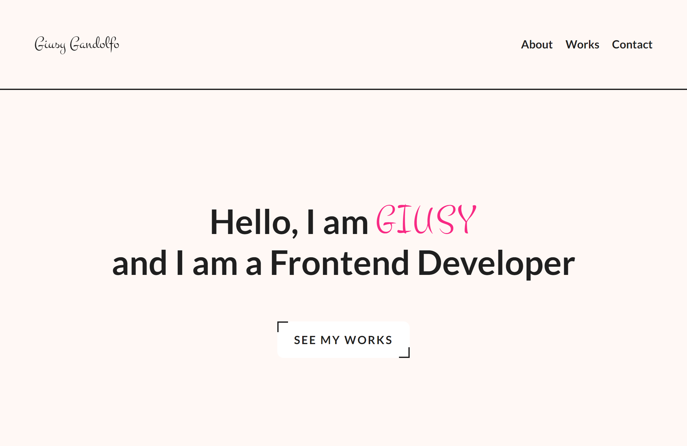

# My portfolio website

## Table of Contents

-   [Overview](#overview)
-   [Built With](#built-with)
-   [Contact](#contact)

## Overview

-   Live Site URL: [Live site URL ](https://portfolio-liard-chi-79.vercel.app/)

    This is a simple portfolio website I have personally designed to show my abilities and my works.

### Built With

-   Semantic HTML5 markup
-   SASS / SCSS
-   Flexbox
-   CSS Grid
-   Mobile-first workflow
-   [React](https://reactjs.org/) - JS library
-   [Next.js](https://nextjs.org/) - React framework
-   [Framer Motion](https://www.framer.com/motion/)

## Contact

-   GitHub - [@Andro87](https://github.com/Andro87)
-   Frontend Mentor - [@Andro87](https://www.frontendmentor.io/profile/Andro87)
